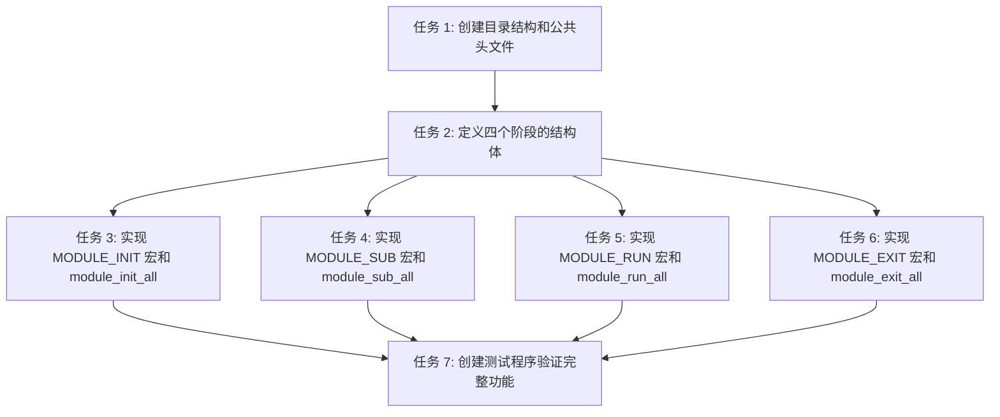

# Phase 1.2: 共享基础设施 - 模块化机制 任务规划

## 1. 概述

本任务规划将 Phase 1.2 "共享基础设施 - 模块化机制" 技术方案拆解为可执行的开发任务清单，每个任务适配 TDD 流程。

**总任务数**: 7 个

**预估总工时**: 约 3-4 小时

---

## 2. 任务依赖图

---

## 3. 任务清单

### 阶段 1: 基础设施

#### 任务 1: 创建目录结构和公共头文件

**通俗解释**: 搭建项目的文件骨架，把必要的文件夹和基础头文件建好，后面的代码才有地方放。

**技术方案章节**: 2. 文件结构

**对应 AC**: 无（基础设施）

**验证标准**:
- `src/include/local_video.h` 文件存在
- `src/shared/module/` 目录存在
- `src/include/local_video.h` 包含基础的头文件保护宏

**TDD RED 阶段输入**:
- 编译时检查文件和目录是否存在
- 包含头文件时不报错

---

#### 任务 2: 定义四个阶段的结构体

**通俗解释**: 为四个生命周期阶段各定义一个结构体，用来装模块名和函数指针。

**技术方案章节**: 3.2 结构体设计

**对应 AC**: AC-014, AC-017

**验证标准**:
- `src/include/local_video.h` 中定义了 `module_init_entry_t` 结构体
- `src/include/local_video.h` 中定义了 `module_sub_entry_t` 结构体
- `src/include/local_video.h` 中定义了 `module_run_entry_t` 结构体
- `src/include/local_video.h` 中定义了 `module_exit_entry_t` 结构体
- 每个结构体都包含 `const char *name` 和 `void (*fn)(void)` 两个字段

**TDD RED 阶段输入**:
- 声明一个 `module_init_entry_t` 类型的变量，编译通过
- 给结构体的 `name` 和 `fn` 字段赋值，编译通过

---

### 阶段 2: 单个阶段实现

#### 任务 3: 实现 MODULE_INIT 宏和 module_init_all 函数

**通俗解释**: 实现初始化阶段的宏和执行函数，让模块可以注册初始化函数，程序启动时能按顺序执行它们。

**技术方案章节**: 3.3.1 MODULE_INIT, 3.4 段遍历执行接口

**对应 AC**: AC-001, AC-005, AC-009, AC-010, AC-017

**验证标准**:
- `src/shared/module/module.h` 中定义了 `MODULE_INIT(fn, module_name)` 宏
- `src/shared/module/module.c` 中实现了 `module_init_all()` 函数
- 使用 `MODULE_INIT(test_init, "test")` 能编译通过
- 调用 `module_init_all()` 能执行注册的函数
- 链接器能生成 `__start_embedi_init` 和 `__stop_embedi_init` 符号

**TDD RED 阶段输入**:
- 创建测试模块：`static void test_init(void) { ... }`，用 `MODULE_INIT(test_init, "test")` 注册
- 调用 `module_init_all()`，验证 `test_init` 被调用

---

#### 任务 4: 实现 MODULE_SUB 宏和 module_sub_all 函数

**通俗解释**: 实现订阅阶段的宏和执行函数，让模块可以在初始化后订阅通知链。

**技术方案章节**: 3.3.2 MODULE_SUB, 3.4 段遍历执行接口

**对应 AC**: AC-002, AC-006, AC-011, AC-017

**验证标准**:
- `src/shared/module/module.h` 中定义了 `MODULE_SUB(fn, module_name)` 宏
- `src/shared/module/module.c` 中实现了 `module_sub_all()` 函数
- 使用 `MODULE_SUB(test_sub, "test")` 能编译通过
- 调用 `module_sub_all()` 能执行注册的函数
- 链接器能生成 `__start_embedi_sub` 和 `__stop_embedi_sub` 符号

**TDD RED 阶段输入**:
- 创建测试模块：`static void test_sub(void) { ... }`，用 `MODULE_SUB(test_sub, "test")` 注册
- 调用 `module_sub_all()`，验证 `test_sub` 被调用

---

#### 任务 5: 实现 MODULE_RUN 宏和 module_run_all 函数

**通俗解释**: 实现运行阶段的宏和执行函数，让模块可以注册运行函数。

**技术方案章节**: 3.3.3 MODULE_RUN, 3.4 段遍历执行接口

**对应 AC**: AC-003, AC-007, AC-012, AC-017

**验证标准**:
- `src/shared/module/module.h` 中定义了 `MODULE_RUN(fn, module_name)` 宏
- `src/shared/module/module.c` 中实现了 `module_run_all()` 函数
- 使用 `MODULE_RUN(test_run, "test")` 能编译通过
- 调用 `module_run_all()` 能执行注册的函数
- 链接器能生成 `__start_embedi_run` 和 `__stop_embedi_run` 符号

**TDD RED 阶段输入**:
- 创建测试模块：`static void test_run(void) { ... }`，用 `MODULE_RUN(test_run, "test")` 注册
- 调用 `module_run_all()`，验证 `test_run` 被调用

---

#### 任务 6: 实现 MODULE_EXIT 宏和 module_exit_all 函数

**通俗解释**: 实现退出阶段的宏和执行函数，让模块可以注册退出函数，程序退出时能清理资源。

**技术方案章节**: 3.3.4 MODULE_EXIT, 3.4 段遍历执行接口

**对应 AC**: AC-004, AC-008, AC-013, AC-017

**验证标准**:
- `src/shared/module/module.h` 中定义了 `MODULE_EXIT(fn, module_name)` 宏
- `src/shared/module/module.c` 中实现了 `module_exit_all()` 函数
- 使用 `MODULE_EXIT(test_exit, "test")` 能编译通过
- 调用 `module_exit_all()` 能执行注册的函数
- 链接器能生成 `__start_embedi_exit` 和 `__stop_embedi_exit` 符号

**TDD RED 阶段输入**:
- 创建测试模块：`static void test_exit(void) { ... }`，用 `MODULE_EXIT(test_exit, "test")` 注册
- 调用 `module_exit_all()`，验证 `test_exit` 被调用

---

### 阶段 3: 端到端验证

#### 任务 7: 创建测试程序验证完整功能

**通俗解释**: 写一个完整的测试程序，验证四个阶段按顺序执行，验证模块可以选择性注册某个阶段。

**技术方案章节**: 5. 使用示例

**对应 AC**: AC-015, AC-016, AC-009（完整覆盖所有 17 条 AC）

**验证标准**:
- 创建 `tests/unit/test_module.c` 测试文件
- 测试程序包含完整模块（注册四个阶段）
- 测试程序包含简化模块（只注册 init/run/exit，不注册 sub）
- 测试程序验证执行顺序：init → sub → run → exit
- 测试程序验证简化模块的 sub 阶段不执行 sub 函数
- 测试程序能编译通过并运行
- 运行输出能证明所有 AC 都满足

**TDD RED 阶段输入**:
- 运行测试程序，观察输出是否符合预期
- 完整模块的四个函数按顺序被调用
- 简化模块的 sub 函数不被调用

---

## 4. AC 追溯表

| AC 编号 | 对应任务 |
|---------|----------|
| AC-001 | 任务 3 |
| AC-002 | 任务 4 |
| AC-003 | 任务 5 |
| AC-004 | 任务 6 |
| AC-005 | 任务 3 |
| AC-006 | 任务 4 |
| AC-007 | 任务 5 |
| AC-008 | 任务 6 |
| AC-009 | 任务 3, 任务 7 |
| AC-010 | 任务 3 |
| AC-011 | 任务 4 |
| AC-012 | 任务 5 |
| AC-013 | 任务 6 |
| AC-014 | 任务 2 |
| AC-015 | 任务 7 |
| AC-016 | 任务 7 |
| AC-017 | 任务 3, 任务 4, 任务 5, 任务 6 |

---

## 5. 验证计划

### 验证项目完成标准

按顺序执行以下验证：

1. **完成任务 1-2 后**:
   - 验证文件和目录创建 ✓
   - 验证结构体定义 ✓

2. **完成任务 3-6 后**:
   - 每个阶段单独测试通过 ✓
   - 每个宏能正常注册和执行 ✓

3. **完成任务 7 后**:
   - 运行完整测试程序 ✓
   - 验证 17 条 AC 全部满足 ✓
   - 执行顺序正确（init → sub → run → exit）✓
   - 模块可选择性注册阶段 ✓
