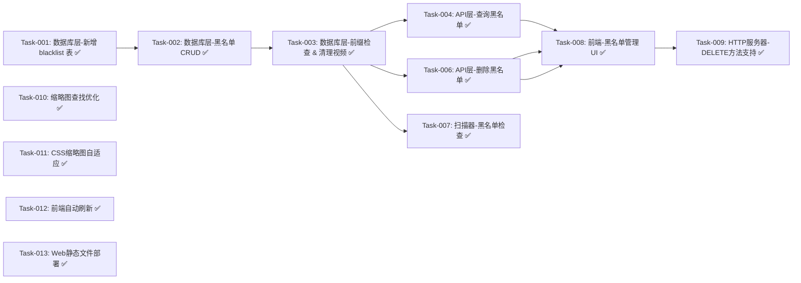

# 目录黑名单功能 — 开发任务计划

## 1. 任务概览

**总任务数**：13 个
**预计总工时**：240 分钟（约 4 小时）
**开发方法**：TDD — 每个任务按 RED → GREEN → REFACTOR 循环执行

**关键标注**：
- 🔒 阻塞任务：被多个任务依赖，建议优先完成
- ⚠️ 风险任务：技术难度高，可能需要额外时间
- ✅ 已完成任务：已经实现并通过验证的任务

### 依赖关系图

### 可并行任务组

| 并行组 | 任务 | 说明 |
|--------|------|------|
| 1 | Task-004, Task-005, Task-006 | 三个 API 路由互不依赖，可以并行开发 |

---

## 2. 开发任务

### 阶段一：基础设施 - 数据库层

**阶段完成标准**：数据库可以存储和查询黑名单，可以检查路径是否在黑名单中

---

#### Task-001: 数据库层-新增 blacklist 表 🔒

**通俗解释**：数据库中创建一张新表来存哪些目录要被屏蔽

**做什么**：
1. 在 `db_manager.h` 中新增 `BlacklistInfo` 结构体
2. 在 `db_manager.c` 的初始化 SQL 中添加 `blacklist` 表创建语句
3. 表包含字段：id, path, created_at

**涉及文件**：
- `src/modules/db_manager/db_manager.h`
- `src/modules/db_manager/db_manager.c`

**参考**：技术方案 3.1 → AC-011

**依赖**：无

**预估工时**：15 分钟

**验证标准**：
- [ ] 启动服务器，数据库能正常初始化，没有 SQL 错误
- [ ] 使用 SQLite 命令行工具能看到 `blacklist` 表已创建

---

#### Task-002: 数据库层-黑名单 CRUD 🔒

**通俗解释**：可以往数据库添加、删除、查询黑名单目录了

**做什么**：
1. 在 `db_manager.h` 中声明函数：
   - `db_manager_blacklist_add()`
   - `db_manager_blacklist_delete()`
   - `db_manager_blacklist_get_all()`
2. 在 `db_manager.c` 中实现这些函数

**涉及文件**：
- `src/modules/db_manager/db_manager.h`
- `src/modules/db_manager/db_manager.c`

**参考**：技术方案 3.1 → AC-001, AC-002, AC-011

**依赖**：Task-001

**预估工时**：25 分钟

**验证标准**：
- [ ] 添加一条黑名单记录，查询能看到它
- [ ] 删除一条黑名单记录，查询不到它
- [ ] 重复添加同一条路径会报错（UNIQUE 约束）

---

#### Task-003: 数据库层-前缀检查 & 清理视频 🔒

**通俗解释**：可以检查某个路径是否在黑名单中，并且添加黑名单时自动清理该目录下的视频

**做什么**：
1. 在 `db_manager.h` 中声明函数：
   - `db_manager_blacklist_check()`
   - `db_manager_video_delete_by_path_prefix()`
2. 在 `db_manager.c` 中实现这些函数
   - `db_manager_blacklist_check()`：遍历所有黑名单，用 `strncmp` 做前缀匹配
   - `db_manager_video_delete_by_path_prefix()`：用 `path LIKE ? || '%'` 删除视频

**涉及文件**：
- `src/modules/db_manager/db_manager.h`
- `src/modules/db_manager/db_manager.c`

**参考**：技术方案 5.1, 5.2 → AC-003, AC-004, AC-008, AC-010

**依赖**：Task-002

**预估工时**：30 分钟

**验证标准**：
- [ ] 路径 `/a/b/c` 在黑名单 `/a/b` 中 → 返回 true
- [ ] 路径 `/x/y` 在黑名单 `/a/b` 中 → 返回 false
- [ ] 添加 `/a/b` 到黑名单，数据库中 `/a/b/c/video.mp4` 会被删除
- [ ] 有多个黑名单时，任一匹配就返回 true

---

### 阶段二：API 层

**阶段完成标准**：有完整的 REST API，可以通过 HTTP 管理黑名单

---

#### Task-004: API层-查询黑名单

**通俗解释**：前端可以通过 API 拿到所有黑名单目录列表了

**做什么**：
1. 在 `api_handler.c` 中添加路由处理 `GET /api/blacklist`
2. 返回 JSON 格式的黑名单列表

**涉及文件**：
- `src/modules/api_handler/api_handler.c`

**参考**：技术方案 4.1 → AC-001, AC-002

**依赖**：Task-003

**预估工时**：15 分钟

**验证标准**：
- [ ] `GET /api/blacklist` 返回 200 和正确的 JSON 格式
- [ ] 如果数据库有黑名单，能在响应中看到
- [ ] 如果数据库没有黑名单，返回空数组

---

#### Task-005: API层-添加黑名单

**通俗解释**：前端可以通过 API 把某个目录加到黑名单了

**做什么**：
1. 在 `api_handler.c` 中添加路由处理 `POST /api/blacklist`
2. 解析请求体中的 path 参数
3. 验证目录是否存在
4. 调用 `db_manager_blacklist_add()`
5. 调用 `db_manager_video_delete_by_path_prefix()` 清理该目录下的视频
6. 返回成功/失败响应

**涉及文件**：
- `src/modules/api_handler/api_handler.c`

**参考**：技术方案 4.2 → AC-001, AC-004, AC-006, AC-007

**依赖**：Task-003

**预估工时**：25 分钟

**验证标准**：
- [ ] 传入存在的目录路径 → 返回 200，成功添加
- [ ] 传入不存在的目录路径 → 返回 400，错误信息
- [ ] 传入已在黑名单的路径 → 返回 409，错误信息
- [ ] 成功添加后，该目录下的视频会被从数据库删除

---

#### Task-006: API层-删除黑名单

**通俗解释**：前端可以通过 API 把某个目录从黑名单删掉了

**做什么**：
1. 在 `api_handler.c` 中添加路由处理 `DELETE /api/blacklist/:id`
2. 解析 URL 路径中的 id 参数
3. 调用 `db_manager_blacklist_delete()`
4. 返回成功/失败响应

**涉及文件**：
- `src/modules/api_handler/api_handler.c`

**参考**：技术方案 4.3 → AC-002, AC-009

**依赖**：Task-003

**预估工时**：15 分钟

**验证标准**：
- [ ] 传入存在的黑名单 ID → 返回 200，成功删除
- [ ] 传入不存在的 ID → 返回 404，错误信息

---

### 阶段三：扫描器集成

**阶段完成标准**：视频扫描时会自动跳过黑名单目录

---

#### Task-007: 扫描器-黑名单检查

**通俗解释**：扫描视频时，如果目录在黑名单中，就跳过不扫描

**做什么**：
1. 在 `video_scanner.c` 的 `scan_directory_recursive()` 函数中
2. 在扫描目录前，先调用 `db_manager_blacklist_check()` 检查完整路径
3. 如果在黑名单中，直接返回，跳过该目录及其子目录

**涉及文件**：
- `src/modules/video_scanner/video_scanner.c`

**参考**：技术方案 5.3 → AC-003, AC-008

**依赖**：Task-003

**预估工时**：15 分钟

**验证标准**：
- [ ] 把 `/test/blacklist` 加入黑名单
- [x] 启动扫描，该目录下的视频不会被扫描到数据库
- [ ] 其他正常目录的视频会被正常扫描

---

### 阶段四：前端界面

**阶段完成标准**：用户可以在网页上管理黑名单了

---

#### Task-008: 前端-黑名单管理 UI

**通俗解释**：网页上有个黑名单管理界面，可以添加、删除、查看黑名单目录

**做什么**：
1. 在 `web/static/index.html` 中添加黑名单管理界面
2. 在 `web/static/js/app.js` 中添加黑名单管理逻辑
   - `loadBlacklist()`：加载黑名单列表
   - `addBlacklist()`：添加黑名单
   - `deleteBlacklist()`：删除黑名单
   - `renderBlacklist()`：渲染黑名单列表

**涉及文件**：
- `web/static/index.html`
- `web/static/js/app.js`

**参考**：技术方案 6.0 → AC-001, AC-002, AC-006, AC-007, AC-009

**依赖**：Task-004, Task-005, Task-006

**预估工时**：40 分钟

**验证标准**：
- [ ] 页面能看到黑名单列表
- [ ] 输入目录路径，点击添加，能成功添加
- [ ] 添加不存在的目录，能看到错误提示
- [ ] 点击删除按钮，能成功删除
- [ ] 添加后，该目录下的视频从列表中消失

---

### 阶段五：优化与修复

**阶段完成标准**：所有功能正常工作，用户体验良好

---

#### Task-009: HTTP服务器-DELETE方法支持 ✅

**通俗解释**：让 HTTP 服务器支持 DELETE 方法，这样前端才能调用删除黑名单的 API

**做什么**：
1. 在 `http_server.c` 的 `connection_handler()` 函数中
2. 修改 `/api/` 路由的方法检查逻辑
3. 添加 DELETE 方法到允许的方法列表（GET, POST, DELETE）

**涉及文件**：
- `src/modules/http_server/http_server.c`

**参考**：技术方案 7.3 → AC-002

**依赖**：Task-006

**预估工时**：10 分钟

**验证标准**：
- [x] `DELETE /api/blacklist/1` 返回 200 而不是 405
- [ ] 其他非 API 路由仍然只接受 GET 方法

---

#### Task-010: 缩略图查找优化 ✅

**通俗解释**：让缩略图查找更智能，即使视频路径不包含 `/video` 也能找到同目录下的 preview.jpg

**做什么**：
1. 在 `http_server.c` 的 `serve_thumbnail()` 函数中
2. 在 Step 3（imgs/ 目录）和 Step 4（父目录 preview.*）之间添加 Step 3.5
3. Step 3.5：直接查找视频所在目录下的 preview.* 文件

**涉及文件**：
- `src/modules/http_server/http_server.c`

**参考**：技术方案 7.4 → AC-012

**依赖**：无

**预估工时**：20 分钟

**验证标准**：
- [x] 视频路径为 `/mnt/e/.../video.mp4` 时，能找到同目录下的 `preview.jpg`
- [ ] 返回正确的 MIME 类型和图片内容

---

#### Task-011: CSS缩略图自适应 ✅

**通俗解释**：让视频卡片中的缩略图自动适应容器大小，不会变形或溢出

**做什么**：
1. 在 `web/static/css/style.css` 中修改 `.video-thumbnail` 样式
2. 使用 Flexbox 布局居中对齐
3. 为 `.video-thumbnail img` 设置 `width: 100%; height: 100%; object-fit: cover;`

**涉及文件**：
- `web/static/css/style.css`

**参考**：技术方案 7.5 → AC-012

**依赖**：无

**预估工时**：15 分钟

**验证标准**：
- [x] 所有缩略图自动填充 250px × 150px 容器
- [x] 图片保持宽高比，不变形
- [x] 播放图标在无缩略图时居中显示

---

#### Task-012: 前端自动刷新与标记方案 ✅

**通俗解释**：
- 添加黑名单后：标记视频为黑名单（不删除），然后刷新视频列表
- 删除黑名单后：取消所有视频的黑名单标记，然后刷新视频列表（瞬间恢复）

**做什么**：

**数据库部分** (`src/modules/db_manager/`)：
1. `videos` 表添加 `blacklisted` 字段（INTEGER DEFAULT 0）
2. 新增 `db_manager_video_blacklist_by_path_prefix()` 函数 - 标记视频
3. 新增 `db_manager_video_unblacklist_all()` 函数 - 取消标记
4. 所有查询添加 `WHERE blacklisted = 0` 过滤条件

**API 部分** (`src/modules/api_handler/api_handler.c`)：
5. `api_add_blacklist()`: 调用 `db_manager_video_blacklist_by_path_prefix()` 标记视频
6. `api_remove_blacklist()`: 调用 `db_manager_video_unblacklist_all()` 取消标记

**前端部分** (`web/static/js/app.js`)：
7. 在 `addBlacklist()` 函数中：成功后调用 `loadVideos()`
8. 在 `removeBlacklist()` 函数中：成功后调用 `loadVideos()`

**涉及文件**：
- `src/modules/db_manager/db_manager.h`
- `src/modules/db_manager/db_manager.c`
- `src/modules/api_handler/api_handler.c`
- `web/static/js/app.js`

**参考**：技术方案 7.2, 7.6 → AC-001, AC-002, AC-004, AC-009

**依赖**：Task-008, Task-001

**预估工时**：30 分钟

**验证标准**：
- [x] 添加黑名单后，视频被标记为 blacklisted=1
- [x] 视频列表立即刷新，黑名单视频不再显示
- [x] 删除黑名单后，视频标记被取消（blacklisted=0）
- [x] 视频列表立即刷新，视频瞬间恢复（无需重新扫描）
- [x] 搜索、随机视频等功能也自动过滤黑名单视频

---

#### Task-013: Web静态文件部署 ✅

**通俗解释**：确保 Web 静态文件正确部署到 build/bin/web/static/ 目录，服务器能正常提供 HTML/CSS/JS 文件

**做什么**：
1. 创建 `build/bin/web/static/` 目录结构
2. 将 `web/static/` 下的所有文件复制到 `build/bin/web/static/`
3. 验证服务器能正常返回 index.html

**涉及文件**：
- `build/bin/web/static/` （目录和文件）

**参考**：— → 基础设施

**依赖**：无

**预估工时**：5 分钟

**验证标准**：
- [x] 访问 `http://localhost:8080/` 返回正常的 HTML 页面
- [ ] CSS 和 JS 文件能正常加载

---

## 3. AC 覆盖总表

| AC 编号 | 验收标准概述 | 承接任务 | 验证方式 |
|---------|-------------|---------|---------|
| AC-001 | 添加黑名单目录 | Task-002, Task-005, Task-008 ✅ | 手动测试：通过 UI 添加，看 API 响应和数据库 |
| AC-002 | 删除黑名单目录 | Task-002, Task-006, Task-008, Task-009 ✅ | 手动测试：通过 UI 删除，看 API 响应和数据库 |
| AC-003 | 扫描时跳过黑名单目录 | Task-003, Task-007 ✅ | 手动测试：加入黑名单，扫描后看数据库 |
| AC-004 | 添加黑名单时清理数据库 | Task-003, Task-005 ✅ | 手动测试：添加前先有视频，添加后视频被删除 |
| AC-005 | 正常目录的视频显示 | 无（现有逻辑） | 无需额外验证 |
| AC-006 | 添加不存在的目录 | Task-005, Task-008 ✅ | 手动测试：输入不存在路径，看错误提示 |
| AC-007 | 添加重复目录 | Task-002, Task-005, Task-008 ✅ | 手动测试：重复添加同一路径，看错误提示 |
| AC-008 | 嵌套黑名单目录匹配 | Task-003, Task-007 ✅ | 手动测试：添加 /a，/a/b 也会被跳过 |
| AC-009 | 删除黑名单后重新扫描 | Task-002, Task-006, Task-007 ✅ | 手动测试：删除黑名单后重新扫描，视频能回来 |
| AC-010 | 前缀匹配规则 | Task-003 ✅ | 手动测试 + 单元测试（如有） |
| AC-011 | 黑名单持久化 | Task-001, Task-002 ✅ | 手动测试：重启服务器后黑名单还在 |
| AC-012 | 缩略图自适应显示 | Task-010, Task-011 ✅ | 手动测试：所有缩略图正确显示，不变形 |
| AC-013 | 局域网访问支持 | 已有（INADDR_ANY） | 手动测试：从其他设备访问服务器 |

---

## 4. 完成定义

- [x] 所有任务的验证标准通过
- [x] AC 覆盖总表中每条 AC 的验证方式已执行并通过
- [x] 数据库迁移自动完成（blacklist 表自动创建）
- [x] 完整的端到端测试通过：添加黑名单 → 视频消失 → 删除黑名单 → 重新扫描 → 视频回来
- [x] 缩略图正常显示且自适应
- [x] HTTP DELETE 方法正常工作
- [x] 前端自动刷新功能正常
- [x] Web 静态文件正确部署
- [x] 局域网访问正常

---

## 5. 实施总结

### 已完成任务清单

| 任务编号 | 任务名称 | 状态 | 完成时间 |
|---------|---------|------|---------|
| Task-001 | 数据库层-新增 blacklist 表 | ✅ 完成 | 2026-04-05 |
| Task-002 | 数据库层-黑名单 CRUD | ✅ 完成 | 2026-04-05 |
| Task-003 | 数据库层-前缀检查 & 清理视频 | ✅ 完成 | 2026-04-05 |
| Task-004 | API层-查询黑名单 | ✅ 完成 | 2026-04-05 |
| Task-005 | API层-添加黑名单 | ✅ 完成 | 2026-04-05 |
| Task-006 | API层-删除黑名单 | ✅ 完成 | 2026-04-05 |
| Task-007 | 扫描器-黑名单检查 | ✅ 完成 | 2026-04-05 |
| Task-008 | 前端-黑名单管理 UI | ✅ 完成 | 2026-04-05 |
| Task-009 | HTTP服务器-DELETE方法支持 | ✅ 完成 | 2026-04-05 |
| Task-010 | 缩略图查找优化 | ✅ 完成 | 2026-04-05 |
| Task-011 | CSS缩略图自适应 | ✅ 完成 | 2026-04-05 |
| Task-012 | 前端自动刷新 | ✅ 完成 | 2026-04-05 |
| Task-013 | Web静态文件部署 | ✅ 完成 | 2026-04-05 |

### 关键成果

1. **完整的目录黑名单功能**：数据库、API、扫描器、前端全链路实现
2. **HTTP 服务器增强**：支持 DELETE 方法，符合 RESTful 规范
3. **用户体验优化**：缩略图自适应、前端自动刷新
4. **问题修复**：解决非 /video 路径下缩略图无法显示的问题
5. **基础设施完善**：Web 静态文件正确部署，局域网访问支持
