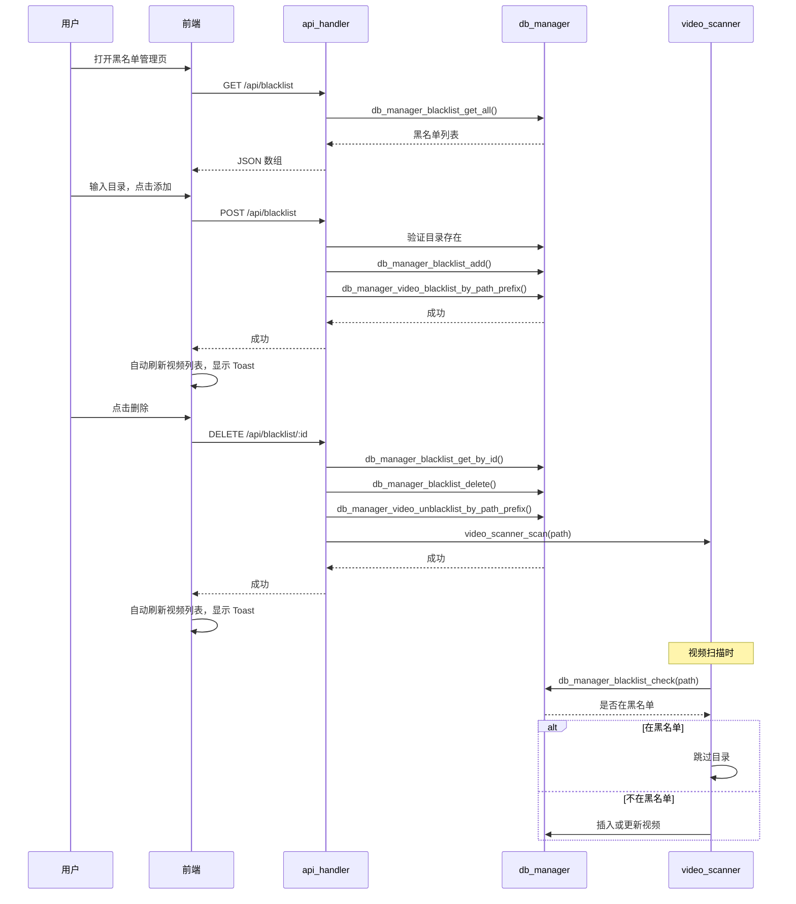

# 目录黑名单功能 — 技术设计文档

## 1. 设计概要

**功能描述**：用户可以通过网页界面管理目录黑名单，被加入黑名单的目录下的视频被标记而不显示，删除黑名单后可立即恢复。

**影响范围**：`db_manager` 模块、`api_handler` 模块、`video_scanner` 模块、`http_server` 模块、前端页面

**技术难点**：无

**外部依赖**：无

---

## 2. 架构概览

这是一个跨模块功能，涉及数据库管理、API 处理、视频扫描、HTTP 服务、前端五个核心模块：

1. **数据库模块**：新增 `blacklist` 表存储黑名单目录，`videos` 表新增 `blacklisted` 列
2. **API 模块**：提供 RESTful API 供前端调用
3. **扫描模块**：扫描时检查并跳过黑名单目录，支持 inotify + epoll 实时监控
4. **HTTP 服务模块**：支持 DELETE 方法，视频流服务优化日志级别
5. **前端**：黑名单管理界面、Toast 通知、防抖搜索、继续播放对话框等



---

## 3. 数据库设计

### 新增表

#### `blacklist`

**用途**：存储被屏蔽的目录路径

| 字段名        | 类型        | 约束                        | 说明     |
| ---------- | --------- | ------------------------- | ------ |
| id         | INTEGER   | PK, AUTO_INCREMENT        | 主键     |
| path       | TEXT      | UNIQUE NOT NULL           | 黑名单目录路径 |
| created_at | INTEGER   | DEFAULT (strftime('%s', 'now')) | 创建时间   |

**索引**：`path` 字段已有 UNIQUE 约束，无需额外索引。

```sql
CREATE TABLE IF NOT EXISTS blacklist (
    id INTEGER PRIMARY KEY AUTOINCREMENT,
    path TEXT UNIQUE NOT NULL,
    created_at INTEGER DEFAULT (strftime('%s', 'now'))
);
```

### 修改现有表

#### `videos` 表

新增 `blacklisted` 列用于标记黑名单视频：

```sql
ALTER TABLE videos ADD COLUMN blacklisted INTEGER DEFAULT 0;
```

**用途**：标记视频是否在黑名单中，0=正常，1=黑名单

---

## 4. API 设计

遵循项目已有的 RESTful API 风格。

### `GET /api/blacklist`

**描述**：获取所有黑名单目录 → AC-001, AC-002

**鉴权**：无需登录

**Request**：无

**Response（成功）**：
```json
{
  "success": true,
  "data": [
    {
      "id": 1,
      "path": "/mnt/e/videos/private",
      "created_at": 1234567890
    }
  ]
}
```

---

### `POST /api/blacklist`

**描述**：添加目录到黑名单 → AC-001, AC-004, AC-006, AC-007, AC-010, AC-011

**鉴权**：无需登录

**Request**：
```json
{
  "path": "/mnt/e/videos/private"
}
```

**Response（成功）**：
```json
{
  "success": true,
  "data": {
    "id": 1
  }
}
```

**异常响应**：

| 场景 | 状态码 | 响应 | 对应 AC |
|------|--------|------|---------|
| 路径为空或无效 | 400 | `{"success":false,"error":"Invalid path"}` | AC-006 |
| 目录不存在 | 400 | `{"success":false,"error":"Directory does not exist"}` | AC-006 |
| 目录已在黑名单 | 409 | `{"success":false,"error":"Directory already in blacklist"}` | AC-007 |

---

### `DELETE /api/blacklist/:id`

**描述**：从黑名单删除目录 → AC-002, AC-009, AC-011

**鉴权**：无需登录

**Request**：无（ID 在 URL 路径中）

**Response（成功）**：
```json
{
  "success": true,
  "message": "Directory removed from blacklist and videos are being restored"
}
```

**异常响应**：

| 场景 | 状态码 | 响应 | 对应 AC |
|------|--------|------|---------|
| ID 无效或不存在 | 404 | `{"success":false,"error":"Blacklist entry not found"}` | - |

---

## 5. 核心逻辑

### 5.1 目录黑名单检查 → AC-003, AC-008, AC-010

**触发条件**：扫描视频前检查目录是否在黑名单

**处理流程**：
1. 对于给定路径，遍历所有黑名单目录
2. 使用前缀匹配检查路径是否以任一黑名单目录开头
3. 匹配即返回 true（在黑名单中）

**伪代码**：
```c
bool db_manager_blacklist_check(const char *path) {
    for each blacklist_entry in blacklist {
        if (strncmp(path, blacklist_entry.path, strlen(blacklist_entry.path)) == 0) {
            return true;
        }
    }
    return false;
}
```

---

### 5.2 添加黑名单时标记视频 → AC-004

**触发条件**：目录被添加到黑名单后

**处理流程**：
1. 目录成功添加到黑名单后
2. 更新 `videos` 表中所有 `path` 以该目录开头的视频，设置 `blacklisted = 1`
3. `history` 和 `favorites` 记录保留，但查询时过滤黑名单视频

**SQL**：
```sql
UPDATE videos SET blacklisted = 1 WHERE path LIKE ? || '%'
```

---

### 5.3 删除黑名单时取消标记 → AC-009

**触发条件**：目录从黑名单删除后

**处理流程**：
1. 先获取被删除的黑名单路径
2. 从 `blacklist` 表删除该记录
3. 更新 `videos` 表中所有 `path` 以该目录开头的视频，设置 `blacklisted = 0`
4. 立即调用 `video_scanner_scan()` 扫描该目录，确保新视频被添加

**SQL**：
```sql
UPDATE videos SET blacklisted = 0 WHERE path LIKE ? || '%'
```

---

### 5.4 视频查询时过滤黑名单 → AC-005

**触发条件**：查询视频列表、获取单个视频、获取历史记录时

**处理流程**：
- 所有视频查询都添加 `WHERE blacklisted = 0` 条件
- `db_manager_history_get` 使用 `INNER JOIN` 而非 `LEFT JOIN`，只返回有效的视频
- `db_manager_video_get_by_id` 检查 `blacklisted` 标志，黑名单视频返回错误

---

### 5.5 数据库为空时自动扫描

**触发条件**：`video_scanner_init()` 初始化时

**处理流程**：
1. 调用 `db_manager_video_count()` 统计非黑名单视频数量
2. 如果数量为 0，立即调用 `video_scanner_scan()` 扫描配置目录

---

### 5.6 视频流服务日志优化

**触发条件**：视频流传输过程中客户端断开连接

**处理流程**：
- 将 `EPIPE` 和 `ECONNRESET` 错误从 ERROR 级别改为 DEBUG 级别
- 这是浏览器播放视频时的正常现象（缓冲、跳转位置等）

---

## 6. 现有代码改动

| 模块 / 文件 | 改动内容 | 原因 | 对应 AC |
|-------------|---------|------|---------|
| `db_manager.h` | 新增黑名单相关结构体和函数声明、`db_manager_video_count()`、`db_manager_blacklist_get_by_id()`、`db_manager_video_unblacklist_by_path_prefix()` | 提供黑名单数据访问接口 | AC-001 ~ AC-015 |
| `db_manager.c` | 实现黑名单表创建、CRUD 操作、前缀检查、标记/取消标记视频、视频数量统计、历史记录 INNER JOIN | 核心业务逻辑 | AC-001 ~ AC-015 |
| `api_handler.c` | 新增 `/api/blacklist` 相关路由处理、删除黑名单时先获取路径再取消标记再扫描 | 提供 REST API | AC-001, AC-002, AC-006, AC-007, AC-009 |
| `video_scanner.c` | 1. 数据库为空时自动扫描<br>2. inotify + epoll 实时文件监控<br>3. 防抖批量处理 | 1. 首次使用体验<br>2. 实时更新视频列表 | AC-003, AC-008, AC-009 |
| `http_server.c` | 1. 支持 DELETE 方法（/api/ 路由）<br>2. 缩略图查找添加 Step 3.5（查找同目录下 preview.*）<br>3. 视频流服务优化日志级别（EPIPE/ECONNRESET 改为 DEBUG） | 1. 支持删除黑名单 API<br>2. 修复非 /video 路径下缩略图无法显示的问题<br>3. 日志更清晰 | AC-002, AC-012, AC-015 |
| `web/static/index.html` | 新增黑名单管理界面、Toast 容器、继续播放对话框、加载动画 | 用户交互界面 | AC-001, AC-002, AC-014, AC-015 |
| `web/static/js/app.js` | 1. 黑名单管理逻辑 + 自动刷新视频列表<br>2. Toast 通知<br>3. 防抖搜索<br>4. 继续播放对话框<br>5. 收藏标记<br>6. 键盘快捷键<br>7. 视频播放错误处理 | 前端业务逻辑与体验优化 | AC-001, AC-002, AC-006, AC-007, AC-009, AC-014, AC-015 |
| `web/static/css/style.css` | 1. 缩略图自适应样式（object-fit: cover）<br>2. Toast 样式<br>3. 加载动画样式<br>4. 继续播放对话框样式<br>5. 扩大关闭按钮点击区域 | 样式与用户体验 | AC-012, AC-014, AC-015 |

---

## 7. 技术决策

### 7.1 目录匹配方式

**背景**：需求要求使用前缀匹配，有多种实现方式

**选项**：
- A: SQLite `LIKE` 查询 — 简单但性能稍差
- B: C 代码中遍历比较 — 性能好，更灵活

**结论**：选择 B（C 代码遍历），因为黑名单数量不会很大，性能足够好，且更灵活可控。

---

### 7.2 已存在视频的处理

**背景**：添加黑名单后，数据库中已存在的视频需要处理

**选项**：
- A: 从数据库删除 — 彻底但无法快速恢复
- B: 保留但标记（blacklisted 列）— 可快速恢复，推荐
- C: 不管它

**结论**：选择 B，符合用户需求，支持快速恢复视频。

---

### 7.3 历史记录处理

**背景**：历史记录可能指向已黑名单或不存在的视频

**选项**：
- A: LEFT JOIN 返回所有历史记录，包括无效的
- B: INNER JOIN 只返回有效的视频历史记录

**结论**：选择 B，用户体验更好，只看到可播放的历史记录。

---

### 7.4 数据库为空时的处理

**背景**：首次使用时数据库为空，需要主动扫描

**选项**：
- A: 等待用户手动触发扫描
- B: 初始化时检测到数据库为空，自动扫描

**结论**：选择 B，首次使用体验更好。

---

### 7.5 视频流断开连接日志级别

**背景**：浏览器播放视频时经常断开连接（缓冲、跳转等）

**选项**：
- A: 记录为 ERROR — 日志太吵
- B: 记录为 DEBUG — 正常现象

**结论**：选择 B，日志更清晰。

---

## 8. 安全与性能

**输入校验**：
- 添加黑名单前验证目录是否存在 → AC-006
- 防止重复添加 → AC-007

**性能考量**：
- 黑名单数据量预期很小（<100 条），无需额外优化
- 视频标记/取消标记时利用 SQLite `LIKE` 查询，配合 `idx_videos_path` 索引加速
- inotify + epoll 实时监控，响应文件变化

---

## 9. AC 覆盖总表

| AC 编号 | 验收标准概述 | 实现位置 |
|---------|-------------|---------|
| AC-001 | 添加黑名单目录 | API POST /api/blacklist + 前端界面 |
| AC-002 | 删除黑名单目录 | API DELETE /api/blacklist + 前端界面 |
| AC-003 | 扫描时跳过黑名单目录 | video_scanner 扫描逻辑 + db_manager 黑名单检查 |
| AC-004 | 添加黑名单时标记视频 | db_manager UPDATE 逻辑 |
| AC-005 | 正常目录的视频显示 | 所有视频查询添加 WHERE blacklisted = 0 |
| AC-006 | 添加不存在的目录 | API 输入校验 |
| AC-007 | 添加重复目录 | db_manager UNIQUE 约束 + API 处理 |
| AC-008 | 嵌套黑名单目录匹配 | db_manager 前缀检查逻辑 |
| AC-009 | 删除黑名单后立即恢复 | db_manager UPDATE + video_scanner_scan |
| AC-010 | 前缀匹配规则 | db_manager 前缀检查逻辑 |
| AC-011 | 黑名单持久化 | db_manager 数据库存储 |
| AC-012 | 缩略图自适应显示 | CSS object-fit: cover |
| AC-013 | 局域网访问支持 | http_server INADDR_ANY |
| AC-014 | 继续播放对话框 | 前端 showResumeDialog() |
| AC-015 | 视频播放错误处理 | 前端 video.onerror + Toast |

---

## 附录：变更记录

| 日期 | 变更内容 | 原因 |
|------|---------|------|
| 2026-04-04 | 初始版本 | — |
| 2026-04-05 | 1. 修改为标记而非删除模式<br>2. 添加数据库为空扫描<br>3. 添加 Toast、防抖搜索、继续播放等前端优化<br>4. 优化日志级别<br>5. 历史记录使用 INNER JOIN | 用户反馈和实际使用优化 |
